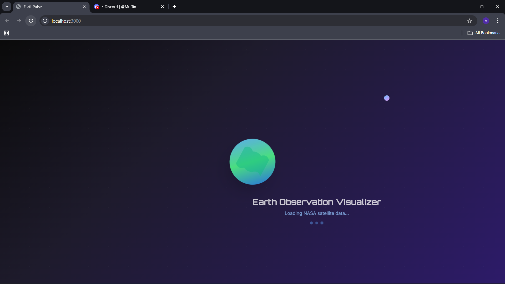
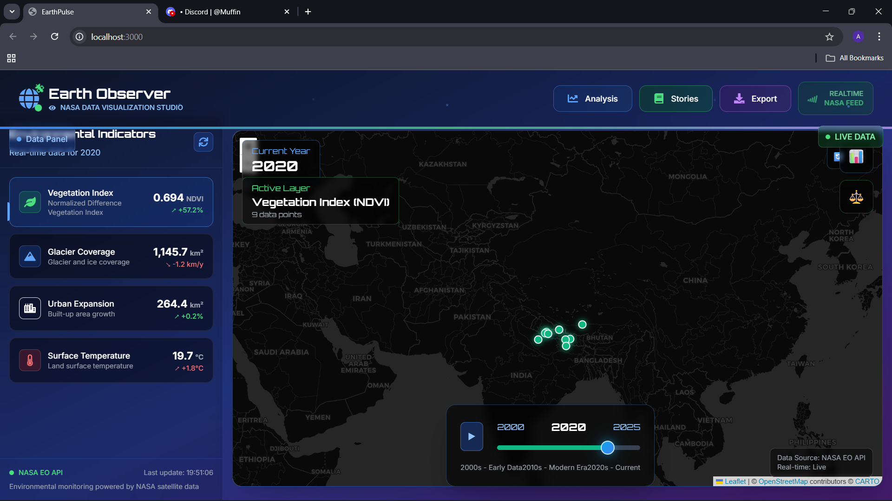
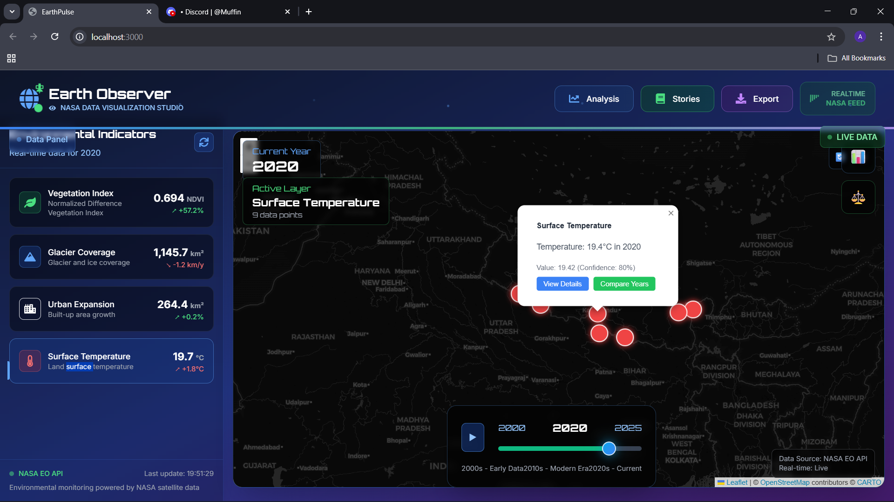
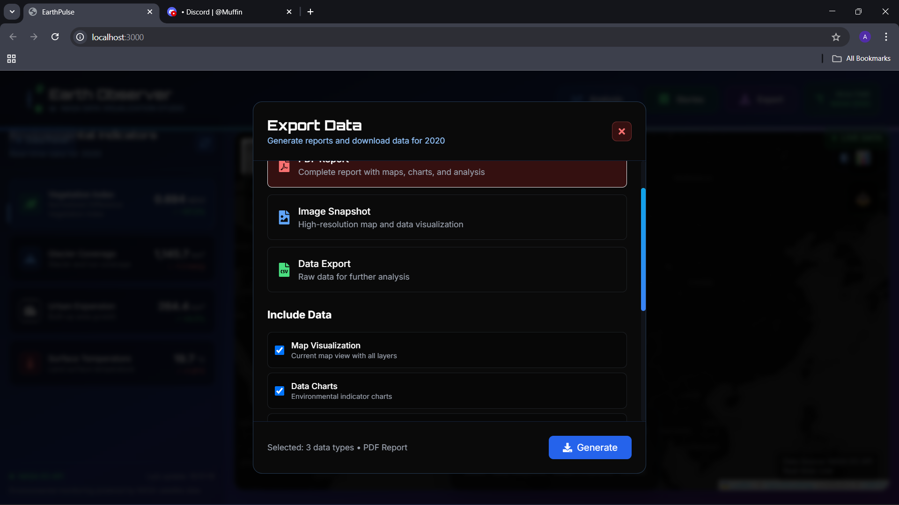

# Earth Observation Visualizer

An interactive visualization platform for environmental and geographic data analysis, focusing on the Himalayan region.

## Features

- Interactive environmental data visualization
- Real-time map-based interface
- Multiple region support (Nepal Himalayas, Kathmandu Valley, Annapurna Region, Everest Region)
- Time-series analysis (2000-2025)
- Environmental indicators tracking:
  - NDVI (Normalized Difference Vegetation Index)
  - Glacier coverage
  - Urban development
  - Temperature patterns

## Demo & Screenshots

### Application Demo
[▶️ Watch Demo Video](assets/screenshots/demo.mp4)

### Screenshots












## Tech Stack

### Frontend
- React with TypeScript
- Vite for build tooling
- Tailwind CSS for styling
- Framer Motion for animations
- MapBox for interactive maps

### Backend
- FastAPI (Python)
- Async support
- Environmental data simulation
- NASA Earth Observation API integration
- Report generation capabilities

## Setup and Installation

### Prerequisites
- Python 3.11+
- Node.js 16+
- npm or yarn

### Backend Setup
```bash
cd backend
python -m venv venv
On Windows: .\venv\Scripts\activate
pip install -r requirements.txt
python run_dev.py
```

### Frontend Setup
```bash
npm install
npm run dev
```

## Usage

1. Start the backend server
2. Launch the frontend application
3. Access the application at `http://localhost:3000`

## Features in Detail

- **Environmental Data Analysis**: Track changes in vegetation, glaciers, urban development, and temperature
- **Interactive Maps**: Explore different regions with detailed geographic visualization
- **Time Series Analysis**: Compare environmental changes over time
- **Data Export**: Download data in various formats (JSON, CSV, XLSX)
- **Report Generation**: Create detailed PDF reports with visualizations

## Contributing

1. Fork the repository
2. Create your feature branch (`git checkout -b feature/AmazingFeature`)
3. Commit your changes (`git commit -m 'Add some AmazingFeature'`)
4. Push to the branch (`git push origin feature/AmazingFeature`)
5. Open a Pull Request

## License

[Add your license here]

## Acknowledgments

- NASA Earth Observation APIs
- MapBox for mapping services
- [Add other acknowledgments]